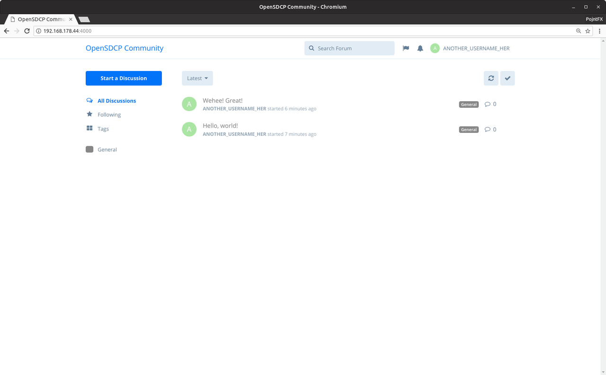

# OpenSDCP Forum

Flarum service configuration for the OpenSDCP project.

> Consider reading the [infrastructure overview](https://github.com/opensdcp/opensdcp-infrastructure#overview) before continuing.

## Demo

Visit [forum.opensdcp.org](https://forum.opensdcp.org/) and take a look at our instance.

## Usage

### Preparation

```bash
# Install dependencies (Ubuntu and Debian)
sudo apt install docker.io docker-compose
# Set password and username of the database
echo \
"FORUM_URL=YOUR_IP
DB_USER=YOUR_USERNAME_HERE
DB_PASSWORD=YOUR_PASSWORD_HERE"\
>> .env
# Read in the env variables
source .env
```

### Startup

```bash
# Serve development version on http://YOUR_IP:4100
docker-compose -f opensdcp-forum-dev.yml up
# ALTERNATIVE: Serve production version on http://YOUR_IP:4000
docker-compose -f opensdcp-forum-prod.yml up
```

### Setup

Visit `http://YOUR_IP:YOUR_PORT_FROM_ABOVE` and continue with the installation. Select the following:

| Key                                 | Value                                              |
| ----------------------------------- | -------------------------------------------------- |
| Forum title                         | `My OpenSDCP Community`                            |
| MySQL host                          | `db`                                               |
| MySQL database                      | `flarum`                                           |
| MySQL user                          | `YOUR_USERNAME_HERE`                               |
| MySQL password                      | `YOUR_PASSWORD_HERE`                               |
| Admin username                      | `ANOTHER_USERNAME_HERE`                            |
| Admin email                         | `you@your-provider.com`                            |
| Admin password and Confirm password | `ANOTHER_PASSWORD_HERE_AT_LEAST_8_CHARACTERS_LONG` |

Use the defaults for the rest and start the installation.

Then reload and sign in (you may already be signed in) to test whether everything works!

If you need some OpenSDCP branding, be sure to check out the [OpenSDCP Design Repository](https://github.com/opensdcp/opensdcp-design).

> If you chose the development version, all the data will be saved in `./opensdcp-forum-web-assets-data-dev/`, './opensdcp-forum-web-extensions-data-dev/' and `./opensdcp-forum-db-data-dev/` in case you want to create backups. If you used the production version, it will be saved in the `opensdcp-forum-web-assets-data`, `opensdcp-forum-web-extensions-data` and `opensdcp-forum-db-data` docker volumes.

## Screenshots



## Documentation

Visit the [official Flarum documentation](http://flarum.org/docs/) to learn more about Flarum.

## Deployment

> Use the Portainer GUI (opensdcp-swarm-manager) to set the env variables by creating the stack there or hard-code them into the opensdcp-forum-prod.yml file. They are NOT being read in by docker stack deploy, which will result in various errors upon setup because the web server container can't connect to the database.

```bash
# Deploy production version to your docker swarm on http://YOUR_IP:4000
docker stack deploy -c opensdcp-forum-prod.yml opensdcp-forum
```

## License

OpenSDCP Flarum Service Configuration (C) 2018 Felicitas Pojtinger

This program is free software: you can redistribute it and/or modify
it under the terms of the GNU General Public License as published by
the Free Software Foundation, either version 3 of the License, or
(at your option) any later version.

This program is distributed in the hope that it will be useful,
but WITHOUT ANY WARRANTY; without even the implied warranty of
MERCHANTABILITY or FITNESS FOR A PARTICULAR PURPOSE. See the
GNU General Public License for more details.

You should have received a copy of the GNU General Public License
along with this program. If not, see <http://www.gnu.org/licenses/>.
